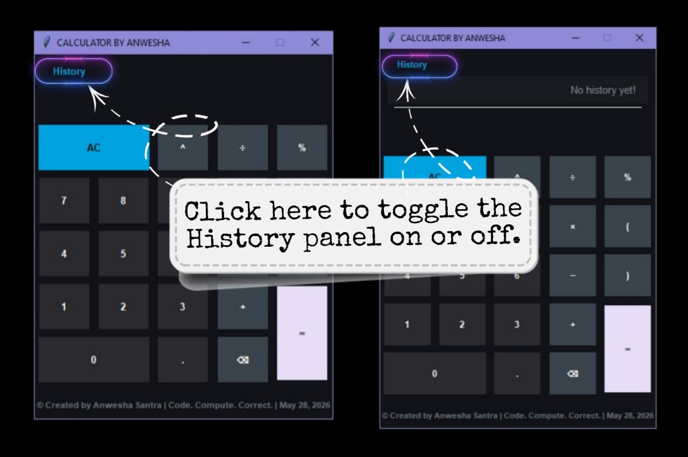
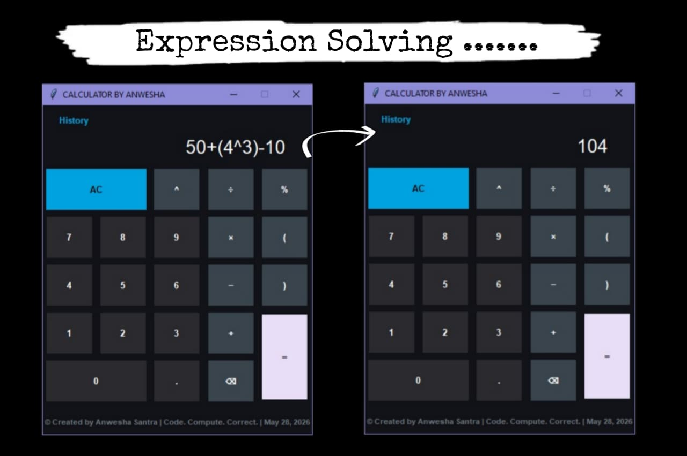
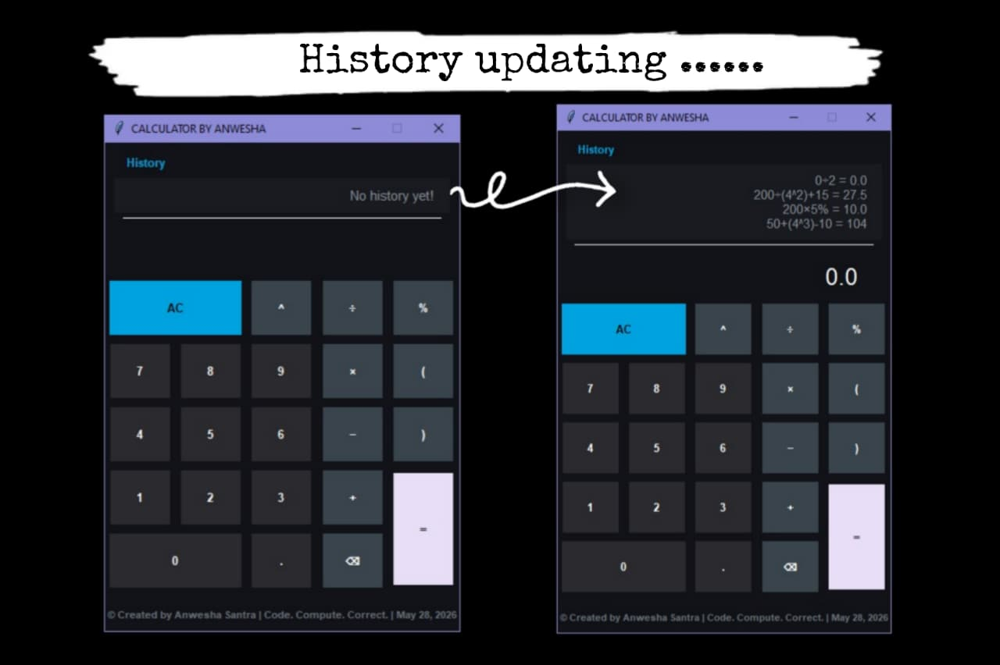

# 📱 Modern Dark Theme Calculator

A modern, sleek, premium, and interactive GUI Calculator built using Python and Tkinter featuring a clean UI and a **Material Dark Theme** color palette and a dynamic, **In-App Toggleable History Panel** that mimics modern smartphone calculators.

---

## 📸 Project Gallery & Demo 

See the calculator in action! Below are the screenshots and a video demonstration of the application features.

---

## 🖼️ Screenshots

### 🔹 Main Interface


### 🔹 Empty History Panel



### 🔹 Equation Evaluation



### 🔹 Calculation History



---

## 🎥 Demo Video

<video src="calculator_pic/calculator.mp4" controls autoplay loop muted width="100%">
</video>

---

## ✨ Features

- 🎨 Modern AMOLED-inspired dark UI
- 🕒 Toggleable calculation history panel
- ➕ Basic arithmetic operations
- 🧠 Power (`^`) calculations
- 📊 Percentage calculations
- ⌫ Backspace support
- 🧹 Clear screen functionality
- 📂 Dynamic history management
- 🖥️ Clean and responsive layout

---

## 🛠️ Tech Stack 

* **Language:** Python 3
* **GUI Framework:** Tkinter

---

## 🧠 Concepts Used

- Grid Layout Management
- Event Handling
- Lambda Functions
- String Manipulation
- Dynamic UI Toggling using `grid_remove()`
- List Slicing and Reversed History Rendering

---

## 🚀 How to Run the Project

1. Ensure that **Python 3** is installed on your local operating system.
2. Clone this repository or download the `calculator.py` source file.
3. Open your terminal or command prompt inside the project directory and execute:
   ```bash
   python calculator.py
